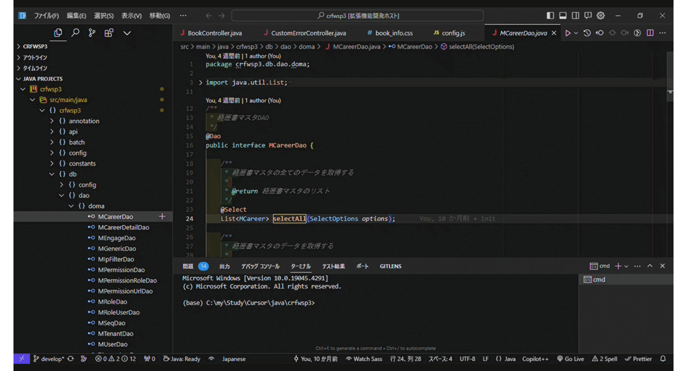

# Doma SQL Jumper
 
 

By pressing the shortcut key Ctrl+Alt+0(Zero), you can open the corresponding SQL file from a method in the Doma2 Dao interface. If the SQL file does not exist, a new SQL file will be created and opened. Similarly, you can open the Dao interface method from a Doma2 SQL file using the same shortcut key.

## Features

## Requirements

none.

## Extension Settings

none.

## Known Issues

none.

## Release Notes

### 1.0.0

Initial release of Doma SQL Jumper.

