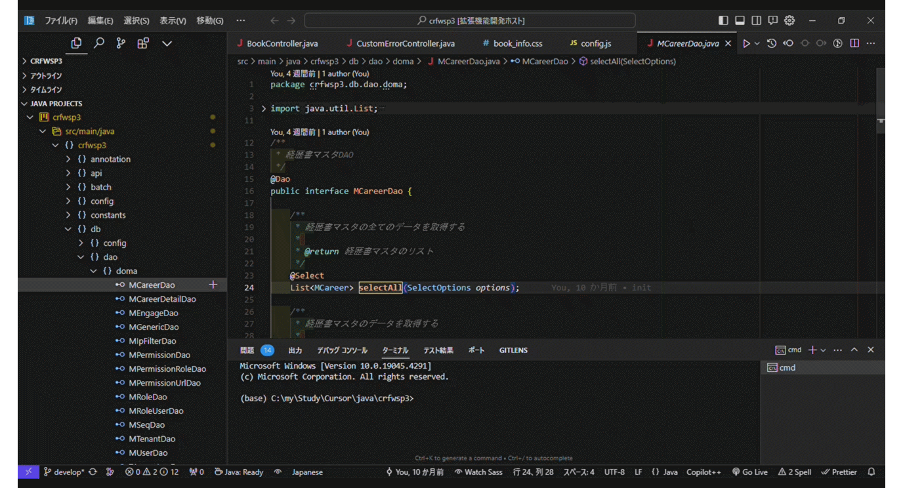

# Doma SQL Jumper
 
 


By pressing the shortcut key Ctrl+Alt+0(Zero), you can open the corresponding SQL file from a method in the Doma2 Dao interface. If the SQL file does not exist, a new SQL file will be created and opened. Similarly, you can open the Dao interface method from a Doma2 SQL file using the same shortcut key.

## Features



## Requirements

none.

## Build

To build this extension:

```bash
# Install dependencies
npm install

# Build for production
npm run package

# Build for development
npm run compile

# Watch mode for development
npm run watch
```

## Create Extension Package

To create a distributable VSIX package:

```bash
# Install vsce (Visual Studio Code Extension CLI)
npm install -g vsce

# Create the extension package
vsce package
```

This will generate a `.vsix` file that can be installed directly into VS Code.

## Publish to Visual Studio Marketplace

To publish your extension to the Visual Studio Marketplace:

```bash
# Create a Personal Access Token (PAT) on https://dev.azure.com/
# Then publish using vsce

# Login to the marketplace
vsce login <publisher-name>

# Publish the extension
vsce publish
```

For detailed instructions, visit the [VS Code Publishing Extensions guide](https://code.visualstudio.com/api/working-with-extensions/publishing-extension).

## Extension Settings

none.

## Known Issues

none.

## Release Notes

### 1.0.3

- Update dependencies

### 1.0.2

- Bump glob from 10.3.12 to 10.5.0

### 1.0.1

- Fix SQL file navigation for subprojects - use dynamic base path detection
- Fix path construction - remove double slash in SQL file path

### 1.0.0

Initial release of Doma SQL Jumper.

